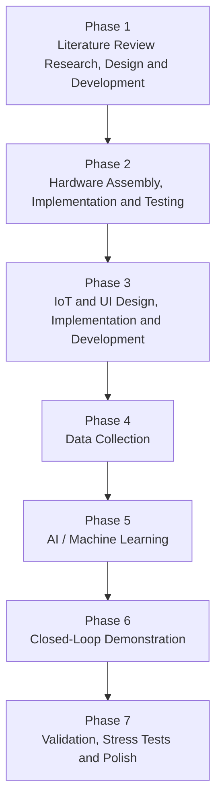

<h1><u>AI-Assisted Condition Monitoring of a Fluid Filtration Rig Using Pressure/Flow Sensor Fusion and Anomaly Detection</u></h1>

## Project Development Flow

# Introduction

Chronic Kidney Disease (CKD) represents a major and growing healthcare challenge within the United Kingdom, with an estimated 7.2 million individuals affected across stages 1–5. In addition, including Polycystic Kidney Disease (PKD), Acute Kidney Injury (AKI) and infectious causes including leptospirosis, all of which can lead to progressive loss of kidney function and, in severe cases, end-stage renal (kidney) failure.

For advanced renal impairment, patients require renal, therapy either dialysis or kidney transplantation. Dialysis substitutes kidney filtration by clearing waste and excess fluid from the blood. In haemodialysis, blood is filtered through an external machine several times a week peritoneal dialysis uses the patient's abdominal membrane for filtration with dialysis fluid. Both methods sustain life but demand ongoing monitoring and significantly affect patients’ time, lifestyle, and health.

Kidney transplantation offers the most complete restoration of renal function however, it is limited by donor organ availability and requires major surgery followed by lifelong immunosuppressive therapy, which carries risks of infection and long-term complications. Consequently, there is sustained interest in improving dialysis technologies, particularly in the areas of system reliability, safety monitoring, and intelligent control.

Modern dialysis systems are complex devices that integrate fluid dynamics, sensors, actuators, and embedded control. Failures such as line blockages, leaks, membrane fouling, and abnormal pressure or flow conditions can compromise treatment safety. This presents the opportunity research, implementation, and prior skills from my course to implement Robotics and AI into this project.

This project aims to develop an AI-assisted condition-monitoring demonstrator based on dialysis machine principles. A benchtop test rig with an ESP32 controller, pumps, and sensors will simulate dialysis-style filtration and circulation using non-biological fluids. Data on pressure, flow, temperature, and conductivity will stream to a supervisory computer for machine-learning models to detect normal and abnormal conditions. A user interface will enable real-time visualization, logging, and alerts.

The aim of the project is not to replicate or replace clinical dialysis, but to investigate how AI-driven monitoring and anomaly detection can enhance the safety, reliability, and autonomy of complex fluid-handling medical devices. The work will be structured into five development phases covering system design, hardware implementation, data acquisition, machine-learning model development, and experimental validation. This approach provides a realistic and academically rigorous platform for exploring the integration of embedded systems, control engineering, and artificial intelligence within a safety-critical biomedical engineering context.

---

# Phase Summary

| Phase   | Duration                |
| ------- | ----------------------- |
| Phase 1 | 3-8 weeks (over summer) |
| Phase 2 | 4-6 weeks               |
| Phase 3 | 2-3 weeks               |
| Phase 4 | 2-3 weeks               |
| Phase 5 | 3-4 weeks               |
| Phase 6 | 4-6 weeks               |
| Phase 7 | 4-6 weeks               |

---

# Phase 1: 3-8 weeks (over summer)

## Literature review research, design, and development

With understanding of how the kidney works and how dialysis works, including how It affects patients with kidney disease and failure. With more professional research within how the kidney and proposed dialysis-inspired artificial filtration systems and their engineering constraints, safety considerations, and sensing requirements.

---

# Phase 2: 4-6 weeks

## Hardware assembly, implementation, and testing

### Deliverables

* Build closed-loop fluid circuit.
* Integrate, peristaltic pump, pressure sensor, temperature sensor.
* ESP32 reads sensors + controls pump.
* Hard safety limits (pressure cutoff, E-stop)
* Serial + basic Wi-Fi data collection
* Leak-free operation for 30+ minutes.

The main deliverable of this part is to ensure that the hardware is physically dependable this includes building a closed-loop fluid circuit. Integrating essential components such as a peristaltic pump, pressure sensor, and temperature sensor. The ESP32 controller will be responsible for reading sensor data and controlling the pump. With safety measures to ensure the system is not damaged due to leakage or other hardware faults such as a pressure cutoff and emergency stop function. As this is the most time-consuming phase, it is essential to begin as early as possible to avoid overruns. The successful completion of these steps will ensure the physical reliability.

---

# Phase 3: 2-3 weeks

## IoT and UI design, implementation, and development

### Deliverables

* MQTT communication ESP32 to PC
* Node-RED dashboard
* Live plots
* Gauges
* Alarm indicators
* Data logging to CSV/SQLite
* Time sync (NTP or RTC)

### KIDAS

* Kidney Inspired
* Intelligent
* Diagnostic
* Analysis
* System

To view and understand the working and data retrieved from this system rather than using print lines or serial monitors (enables two-way communication between your computer and an Arduino board via the USB connection). I am planning to make full use of the ESP32’s ability of inbuilt WIFI, connected to a PC using MQTT protocols combined with Node RED. Which is planned to house the dashboard of my project, incorporating live plots and numeric gauges to provide real-time visualisation of data. The dashboard will include conditional status (alarm system) to alert users to anomalies, Allowing for monitoring and immediate feedback.

Ideally my system will be able to support CSV files for efficient storage and later analysis of operational data. Time synchronisation, either via NTP or using a real-time clock (RTC), will be implemented to maintain accurate timestamps across all logs and events. With previous experience with UI design, Node-RED as well Microsoft applications I believe this would be a crucial step within this project.

---

# Phase 4: 2-3 weeks

## Data collection

### Deliverables

* Normal operation
* Partial blockage
* Leak simulation
* Restriction

### Target

* 3–6 hours of clean normal data
* 30–60 labelled fault events

To collect the data and ensure a fair and accurate account, I plan to run simulations to collect data under several operating conditions. will cover normal operation at various flow rates, tests with partial blockages, leak simulations, as well as scenarios representing restriction within the system. By systematically introducing these conditions, a comprehensive dataset reflecting both expected and fault states will be compiled.

My main goal to collect useful data is to retrieves 3-6 hours of “clean” normal operational data, running alongside 30-60 faults. This combination will provide a solid foundation for subsequent analysis, supporting the development and validation of AI and machine learning models in later project phases.

---

# Phase 5: 3-4 weeks

## AI / Machine Learning

### Deliverables

### Train

* Anomaly detector
* Fault classifier

### Evaluate

* Detection time
* False positive rate
* Confusion matrix
* Integrate live inference with Node-RED alerts.

With extraction of key features from the collected data, such as pressure slope, flow ratio, and variance. Following this, the focus will shift to training both an anomaly detector and a fault classifier, which are essential for identifying deviations and categorising diverse types of faults within the system.

The evaluation process will examine metrics including detection time, false positive rate, and the effectiveness of each model. Additionally, live inference will be integrated with Node-RED alerts to enable real-time monitoring and rapid response to detect anomalies.

---

# Phase 6: 4-6 weeks

## Closed-Loop Demonstration

### Deliverables

* AI flags anomaly
* Command sent to ESP32 (slow pump, stop, flush)
* Safety layer overrides if needed.
* Demonstrate in video + plots.

To thoroughly document performance and system behaviour, the demonstration will be captured in a video, complemented by plots illustrating the key results and system responses. This comprehensive evidence will support the effectiveness and robustness of the closed-loop approach.

In terms of how I plan to demonstrate system’s capability to respond to detected anomalies in real time. When the AI model flags anomalies within the system a command is sent to the ESP32, which can take actions such as slowing down the pump, stopping it, or initiating a flush. To counterbalance against false positives as previously mentioned I plan to implement safety layer to override automated responses if necessary, ensuring operational safety throughout the process.

---

# Phase 7: 4-6

## Validation, stress tests, and polish

### Deliverables

* Risk & safety analysis.
* Experimental results
* Comparison of models
* Limitations & future work

As the project ends, I will begin finalizing the documentation including risk assessment, health and safety, ethical AI, experiments, and simulation results comparison of models. But also providing insight into the system’s real-world performance under various conditions.

Additionally, a comparison of models will be conducted to evaluate and benchmark different approaches. A discussion on limitations of the current work and recommendations for future improvements and investigations.

This affordable, non-clinical system uses readily available components (ESP32 controller, peristaltic pump, sensors, and 3D-printed housing) commonly found in teaching and research labs. The hardware costs about £150–£200, making it accessible and easy to replicate for student projects and educational use.

---

# Table 1 Cost Plan and Justification

| Component                           | Purpose                                                                            | Estimated Cost | Justification                                                                                                         |
| ----------------------------------- | ---------------------------------------------------------------------------------- | -------------- | --------------------------------------------------------------------------------------------------------------------- |
| ESP32                               | Embedded controller for sensor acquisition, pump control, and Wi-Fi communication. | £10            | Provides real-time control, IoT connectivity, and sufficient processing power for a cyber-physical monitoring system. |
| Peristaltic Pump (12v)              | Circulates fluid through a closed loop.                                            | £30            | Enables safe, contamination-free fluid transport with controllable flow rate.                                         |
| Pressure Sensor                     | Monitors pressure for leaks, blockages, and safety detection.                      | £25            | Critical for fault detection.                                                                                         |
| Temperature sensor                  | Measures fluid temperature for compensation and monitoring.                        | £4             | Low-cost, accurate sensor widely used in embedded systems.                                                            |
| Conductivity / TDS Sensor           | Proxy measurement of solute concentration (“waste” level).                         | £20            | Enables demonstration of filtration and effectiveness.                                                                |
| MOSFET/Motor Driver Module          | Drives pump and optional valves from ESP32.                                        | £8             | Required for safe control.                                                                                            |
| Power Supply + Buck Converter       | Provides regulated 12V and 5V rails.                                               | £15            | Ensures stable and safe operation of electronics and pump.                                                            |
| Emergency stop switch (E-Stop)      | Safe hardware shutdown.                                                            | £7             | Required for risk mitigation and safe operation.                                                                      |
| Leak Sensor                         | Detects leakage.                                                                   | £5             | Supports safe monitoring.                                                                                             |
| RTC Module (DS3231)                 | Proved an accurate time stamp of data.                                             | £5             | Ensures reliable logging when Wi-Fi time sync is unavailable.                                                         |
| Silicone Tubing & Fittings          | Fluid transport and sealing.                                                       | £15            | Required for closed-loop circulation and leak-free operation.                                                         |
| Inline Filter / Restrictor          | Simulates membrane fouling and flow restriction.                                   | £10            | Enables controlled fault injection for AI training and validation.                                                    |
| (2x)                                | Stores circulating and waste fluids.                                               | £8             | Necessary for continuous loop operation.                                                                              |
| 3D Printed Enclosure & Mounts       | Mechanical housing and safety containment.                                         | £15            | Provides structural support and spill containment.                                                                    |
| Misc. Wiring, Connectors, Fasteners | Electrical and mechanical integration.                                             | £10            | Required for dependable assembly.                                                                                     |

## Total estimated cost of this project is:

**£187 with everything listed above, £152 excluding 3D prints, preowned equipment.**

---

### Sources

<li><a href="https://www.nhs.uk/conditions/kidney-disease">Kidney Disease</a> </li>

<li><a href = "https://www.sciencedirect.com/science/article/pii/S0272638625000538">The Future of Technology-Based Kidney Replacement Therapies</a> </li>

<li><a href = "https://pmc.ncbi.nlm.nih.gov/articles/PMC10989479/#sec8">Artificial kidney: Challenges and opportunities</a> </li>
