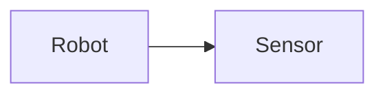
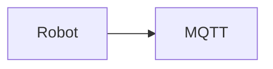

# Mermaid Flowcharts — How to Create and Use Them

## 1. What is a Mermaid Flowchart?

A Mermaid flowchart is a diagram created using text.

Instead of manually drawing boxes and arrows, you write instructions such as:

```text
flowchart LR
    A[Robot] --> B[Collect Telemetry]
    B --> C[Store Data]
```

Mermaid then turns those instructions into a visual flowchart.

The important idea is:

```text
NODE --> NODE
```

For example:

```text
Robot --> Sensor
```

means:

```text
Robot → Sensor
```

Mermaid is useful because the flowchart can be stored as normal text inside your project and changed whenever the system changes.

---

# 2. Creating Your First Flowchart

Every Mermaid flowchart needs to start by declaring that it is a flowchart.

For example:

```text
flowchart LR
```

`flowchart` tells Mermaid:

> Create a flowchart.

`LR` tells Mermaid:

> Arrange the flowchart from Left to Right.

You can then add components underneath it:

```text
flowchart LR
    A[Robot] --> B[Sensor]
```

The complete Mermaid block inside a Markdown file would be:

````markdown

````

When rendered, Mermaid creates:

```text
┌───────┐       ┌────────┐
│ Robot │  ───> │ Sensor │
└───────┘       └────────┘
```

---

# 3. Understanding Node IDs

Consider:

```text
A[Robot]
```

There are two different parts here.

```text
A
```

is the **node ID**.

```text
[Robot]
```

contains the text displayed in the diagram.

Therefore:

```text
A[Robot]
```

means:

> Create a node called `A` and display the word `Robot`.

You could write:

```text
ROBOT[Robot]
```

This does exactly the same thing.

For larger diagrams, meaningful IDs are much easier to understand.

Instead of:

```text
A[Robot]
B[MQTT]
C[Node-RED]
D[SQLite]
```

use:

```text
ROBOT[Robot]
MQTT[MQTT Broker]
NODE_RED[Node-RED]
DATABASE[SQLite Database]
```

Then:

```text
flowchart LR
    ROBOT[Robot] --> MQTT[MQTT Broker]
    MQTT --> NODE_RED[Node-RED]
    NODE_RED --> DATABASE[SQLite Database]
```

Notice that after a node has been created, you can simply use its ID again.

You do not have to write:

```text
MQTT[MQTT Broker]
```

every time.

You can simply write:

```text
MQTT
```

---

# 4. Flowchart Direction

The letters after `flowchart` control the general direction of the diagram.

## Left to Right — LR

```text
flowchart LR
```

Means:

> Left to Right

Example:

```text
flowchart LR
    A[Robot] --> B[MQTT] --> C[Node-RED]
```

Produces a flow similar to:

```text
Robot → MQTT → Node-RED
```

This is useful for:

* System architecture
* Data pipelines
* Communication systems
* Telemetry flow

---

## Top to Bottom — TD

```text
flowchart TD
```

Means:

> Top Down

Example:

```text
flowchart TD
    A[Start]
    A --> B[Collect Data]
    B --> C[Analyse Data]
    C --> D[End]
```

Produces:

```text
Start
  ↓
Collect Data
  ↓
Analyse Data
  ↓
End
```

This is useful for:

* Algorithms
* Program logic
* Experimental procedures
* Decision processes

---

## Top to Bottom — TB

You may also see:

```text
flowchart TB
```

`TB` means:

> Top to Bottom

It is effectively the same general direction as `TD`.

---

## Right to Left — RL

```text
flowchart RL
```

Means:

> Right to Left

Example:

```text
flowchart RL
    A --> B --> C
```

This is less commonly required but can be useful when arranging a complicated diagram.

---

## Bottom to Top — BT

```text
flowchart BT
```

Means:

> Bottom to Top

Again, this is less commonly used.

---

# 5. Basic Rectangle Node

The most common node is:

```text
A[Process]
```

The square brackets:

```text
[ ]
```

create a rectangular process box.

Example:

```text
flowchart LR
    A[Collect Telemetry]
```

Use rectangles for normal processes such as:

* Read sensor
* Store data
* Move robot
* Analyse telemetry
* Publish MQTT message
* Calculate anomaly score

---

# 6. Rounded Node

Use parentheses:

```text
A(Process)
```

Example:

```text
flowchart LR
    A(Start Process)
```

This produces a rounded shape.

Rounded shapes can be useful for distinguishing certain stages from normal rectangular processes.

---

# 7. Start and End Nodes

A common flowchart convention is to make Start and End visually different.

For example:

```text
START([Start])
```

and:

```text
END([End])
```

Example:

```text
flowchart TD
    START([Start])
    START --> PROCESS[Collect Data]
    PROCESS --> END([End])
```

This gives you:

```text
   Start
     ↓
Collect Data
     ↓
    End
```

---

# 8. Decision Nodes

One of the most important flowchart shapes is the decision.

Use curly brackets:

```text
A{Decision?}
```

For example:

```text
FAULT{Fault Detected?}
```

This creates a diamond-shaped decision node.

Example:

```text
flowchart TD
    DATA[Read Telemetry]
    CHECK{Fault Detected?}

    DATA --> CHECK
```

A decision normally has multiple outputs.

For example:

```text
flowchart TD
    DATA[Read Telemetry]
    CHECK{Fault Detected?}
    NORMAL[Continue Operation]
    WARNING[Generate Warning]

    DATA --> CHECK
    CHECK -->|No| NORMAL
    CHECK -->|Yes| WARNING
```

The important syntax here is:

```text
-->|Yes|
```

and:

```text
-->|No|
```

These add labels to the arrows.

---

# 9. Circle Nodes

Double parentheses create a circle:

```text
A((Node))
```

Example:

```text
flowchart LR
    A((Sensor))
```

Circles can be useful for:

* Connection points
* Small events
* Intermediate states

Do not use different shapes simply because they look interesting.

Shapes should ideally communicate something.

---

# 10. Database Shape

A useful shape for your project is:

```text
DB[(SQLite)]
```

This produces a database/cylinder-style node.

Example:

```text
flowchart LR
    DATA[Telemetry] --> DB[(SQLite Database)]
```

For AEGIS, this makes it immediately obvious that SQLite represents stored data rather than another processing stage.

---

# 11. Basic Arrow

The normal arrow is:

```text
-->
```

Example:

```text
A --> B
```

Means:

```text
A → B
```

Example:

```text
flowchart LR
    SENSOR[Sensor] --> ESP32[ESP32]
```

---

# 12. Connecting Several Nodes

You can connect nodes individually:

```text
flowchart LR
    A[Robot]
    B[Sensor]
    C[MQTT]
    D[Node-RED]

    A --> B
    B --> C
    C --> D
```

You can also write a simple chain:

```text
flowchart LR
    A[Robot] --> B[Sensor] --> C[MQTT] --> D[Node-RED]
```

Both approaches are valid.

For small diagrams, chaining is convenient.

For larger diagrams, separate lines are normally easier to read and modify.

---

# 13. Arrow Labels

You can explain what travels along an arrow.

Use:

```text
A -->|Label| B
```

Example:

```text
ESP32 -->|Telemetry| MQTT
```

Full example:

```text
flowchart LR
    ESP32[ESP32]
    MQTT[MQTT Broker]

    ESP32 -->|Telemetry| MQTT
```

For AEGIS, labels could include:

```text
Joint Angles
Temperature
Motor Current
Vibration
Telemetry
MQTT Message
Anomaly Score
Robot Command
```

For example:

```text
flowchart LR
    ROBOT[Niryo One]
    MONITOR[Monitoring System]

    ROBOT -->|Joint Telemetry| MONITOR
```

---

# 14. Line Without an Arrow

Use:

```text
---
```

Example:

```text
A --- B
```

This creates a connection without a directional arrow.

Use this when two components are related but you do not want to imply a direction.

For data flow, `-->` is normally more appropriate because the direction matters.

---

# 15. Dotted Arrow

Use:

```text
-.-> 
```

Example:

```text
A -.-> B
```

This creates a dotted connection.

It can be useful for showing something that is:

* Optional
* Secondary
* Indirect
* Planned rather than currently implemented

For example:

```text
flowchart LR
    AI[AI Detection]
    STOP[Automatic Robot Stop]

    AI -.->|Optional| STOP
```

If automatic stopping is an optional future part of a system, the dotted connection helps visually distinguish it from the main data path.

---

# 16. Thick Arrow

Use:

```text
==>
```

Example:

```text
A ==> B
```

This creates a heavier connection.

It can be used to emphasise an important path.

Do not overuse it.

If every connection is emphasised, none of them are emphasised.

---

# 17. Branching

One node can connect to several nodes.

Example:

```text
flowchart TD
    A[Telemetry]
    B[Node-RED]
    C[SQLite]
    D[AI Model]

    A --> B
    B --> C
    B --> D
```

Conceptually:

```text
             ┌→ SQLite
Telemetry → Node-RED
             └→ AI Model
```

This is useful when the same data is sent to multiple places.

---

# 18. Decisions and Branches

A very common structure is:

```text
Process
   ↓
Decision
 ↙     ↘
Yes     No
```

In Mermaid:

```text
flowchart TD
    DATA[Read Telemetry]
    CHECK{Anomaly Detected?}
    NORMAL[Continue Operation]
    WARNING[Generate Warning]

    DATA --> CHECK
    CHECK -->|No| NORMAL
    CHECK -->|Yes| WARNING
```

---

# 19. Joining Paths Back Together

Branches can later reconnect.

Example:

```text
flowchart TD
    CHECK{Fault?}

    CHECK -->|No| NORMAL[Normal Operation]
    CHECK -->|Yes| WARNING[Warning]

    NORMAL --> CONTINUE[Continue Monitoring]
    WARNING --> CONTINUE
```

This produces logic similar to:

```text
              ┌→ Normal ───┐
Fault? ───────┤             ├→ Continue Monitoring
              └→ Warning ──┘
```

This is useful for loops and repeated monitoring processes.

---

# 20. Creating a Loop

Flowcharts can point backwards to previous nodes.

Example:

```text
flowchart TD
    READ[Read Telemetry]
    ANALYSE[Analyse Telemetry]
    CHECK{Stop Monitoring?}

    READ --> ANALYSE
    ANALYSE --> CHECK

    CHECK -->|No| READ
    CHECK -->|Yes| END([End])
```

This shows that telemetry continues to be collected until monitoring stops.

---

# 21. A Simple AEGIS Monitoring Loop

```text
flowchart TD
    START([Start AEGIS])
    READ[Read Robot Telemetry]
    ANALYSE[Analyse Telemetry]
    CHECK{Anomaly Detected?}
    NORMAL[Normal State]
    WARNING[Warning / Fault State]
    CONTINUE{Continue Monitoring?}
    END([End])

    START --> READ
    READ --> ANALYSE
    ANALYSE --> CHECK

    CHECK -->|No| NORMAL
    CHECK -->|Yes| WARNING

    NORMAL --> CONTINUE
    WARNING --> CONTINUE

    CONTINUE -->|Yes| READ
    CONTINUE -->|No| END
```

This type of flowchart explains **program or system logic** rather than physical system architecture.

---

# 22. Subgraphs

Subgraphs allow you to group related components.

The basic syntax is:

```text
subgraph NAME
    ...
end
```

Example:

```text
flowchart LR

    subgraph ROBOT
        ARM[Niryo One]
        SENSOR[Sensors]

        ARM --> SENSOR
    end

    subgraph COMPUTER
        MQTT[MQTT Broker]
        NODE_RED[Node-RED]
        DB[(SQLite)]
    end

    SENSOR --> MQTT
    MQTT --> NODE_RED
    NODE_RED --> DB
```

This visually groups the robot components separately from the computer components.

---

# 23. Giving a Subgraph a Better Name

Instead of displaying an internal ID, you can use:

```text
subgraph ROBOT["Robotic Arm"]
```

Example:

```text
flowchart LR

    subgraph ROBOT["Niryo One Robotic Arm"]
        SENSOR[Telemetry]
    end

    subgraph PC["Monitoring Computer"]
        MQTT[MQTT]
        NODE_RED[Node-RED]
        DB[(SQLite)]
    end

    SENSOR --> MQTT
    MQTT --> NODE_RED
    NODE_RED --> DB
```

This is useful for architecture diagrams because it can show which software runs on which device.

---

# 24. Creating a Flowchart From Scratch

A good process is to build the diagram gradually.

Suppose you want to explain:

> The robot generates telemetry. The telemetry is sent through MQTT to Node-RED. Node-RED stores it in SQLite and sends it to an anomaly-detection model.

First, identify the components:

```text
Niryo One
MQTT
Node-RED
SQLite
AI Model
```

Create the nodes:

```text
ROBOT[Niryo One]
MQTT[MQTT Broker]
NODE_RED[Node-RED]
DATABASE[(SQLite)]
AI[Anomaly Detection]
```

Now determine the direction of information:

```text
Niryo One
    ↓
MQTT
    ↓
Node-RED
   ↙   ↘
SQLite  AI
```

Because this is architecture/data flow, `LR` may be easier to read:

```text
flowchart LR
```

Now connect the components:

```text
flowchart LR
    ROBOT[Niryo One]
    MQTT[MQTT Broker]
    NODE_RED[Node-RED]
    DATABASE[(SQLite)]
    AI[Anomaly Detection]

    ROBOT --> MQTT
    MQTT --> NODE_RED
    NODE_RED --> DATABASE
    NODE_RED --> AI
```

Finally, add useful labels:

```text
flowchart LR
    ROBOT[Niryo One]
    MQTT[MQTT Broker]
    NODE_RED[Node-RED]
    DATABASE[(SQLite)]
    AI[Anomaly Detection]

    ROBOT -->|Telemetry| MQTT
    MQTT -->|MQTT Messages| NODE_RED
    NODE_RED -->|Store Data| DATABASE
    NODE_RED -->|Telemetry| AI
```

That is generally a better way to create a diagram than trying to write the entire finished flowchart immediately.

---

# 25. Flowchart or Architecture Diagram?

Mermaid flowcharts can be used for both.

However, think about what you are trying to explain.

## Architecture

Question:

> What components make up the system?

Example:

```text
flowchart LR
    ROBOT[Niryo One]
    MQTT[MQTT]
    NODE_RED[Node-RED]
    DATABASE[(SQLite)]
    AI[AI Model]

    ROBOT --> MQTT
    MQTT --> NODE_RED
    NODE_RED --> DATABASE
    NODE_RED --> AI
```

## Process

Question:

> What happens when the program runs?

Example:

```text
flowchart TD
    START([Start])
    READ[Read Telemetry]
    ANALYSE[Analyse Data]
    CHECK{Fault?}
    WARNING[Generate Warning]
    CONTINUE[Continue Monitoring]

    START --> READ
    READ --> ANALYSE
    ANALYSE --> CHECK

    CHECK -->|Yes| WARNING
    CHECK -->|No| CONTINUE
```

Both are Mermaid flowcharts, but they communicate different information.

---

# 26. How to Use Mermaid in a Markdown File

Inside a `.md` file, use:

````markdown

````

The first line:

````text
```mermaid
````

tells the Markdown renderer that the contents are Mermaid syntax.

The final:

```text
```

````

closes the Mermaid code block.

---

# 27. Creating a Separate Mermaid File

You can also save Mermaid source separately.

For example:

```text
aegis_architecture.mmd
````

Inside:

```text
flowchart LR
    ROBOT[Niryo One]
    MQTT[MQTT Broker]
    NODE_RED[Node-RED]

    ROBOT --> MQTT
    MQTT --> NODE_RED
```

The `.mmd` file contains Mermaid source rather than normal Markdown.

This can be useful when you want to export diagrams as images.

---

# 28. Previewing the Diagram

When working in VS Code, you can keep the diagram inside a Markdown file:

```text
README.md
```

or:

```text
architecture.md
```

Then use Markdown Preview.

A common shortcut is:

```text
Ctrl + Shift + V
```

If your Markdown preview supports Mermaid, the flowchart will be rendered.

If Mermaid is not rendered by your particular preview setup, a Mermaid-compatible VS Code extension or the Mermaid Live Editor can be used.

---

# 29. Exporting a Flowchart as an Image

For a technical report, you may want:

```text
Mermaid source
      ↓
Rendered flowchart
      ↓
SVG / PNG
      ↓
Report
```

SVG is normally preferable for diagrams because it is a vector image.

This means text, lines and shapes remain sharp when the image is resized.

PNG is useful when the software receiving the image does not handle SVG properly.

---

# 30. Mermaid CLI

If Mermaid CLI is installed, a `.mmd` file can be converted from the command line.

For example:

```bash
mmdc -i aegis_architecture.mmd -o aegis_architecture.svg
```

Here:

```text
mmdc
```

runs Mermaid CLI.

```text
-i
```

means:

> Input

Therefore:

```text
-i aegis_architecture.mmd
```

means:

> Use `aegis_architecture.mmd` as the input.

Then:

```text
-o
```

means:

> Output

Therefore:

```text
-o aegis_architecture.svg
```

means:

> Create `aegis_architecture.svg`.

For PNG:

```bash
mmdc -i aegis_architecture.mmd -o aegis_architecture.png
```

---

# 31. Useful Flowchart Syntax Cheat Sheet

## Create flowchart

```text
flowchart LR
```

Left to right.

```text
flowchart TD
```

Top down.

---

## Rectangle

```text
A[Process]
```

Use for a normal process.

---

## Rounded shape

```text
A(Process)
```

---

## Start / End style

```text
A([Start])
```

---

## Decision

```text
A{Decision?}
```

Use for Yes/No or other conditional logic.

---

## Circle

```text
A((Node))
```

---

## Database

```text
A[(Database)]
```

---

## Normal arrow

```text
A --> B
```

---

## Labelled arrow

```text
A -->|Telemetry| B
```

---

## Line

```text
A --- B
```

---

## Dotted arrow

```text
A -.-> B
```

---

## Thick arrow

```text
A ==> B
```

---

## Subgraph

```text
subgraph SYSTEM["System Name"]
    A
    B
end
```

---

# 32. Which Shape Should I Use?

A simple rule is:

| Meaning                | Mermaid         |
| ---------------------- | --------------- |
| Normal process         | `A[Process]`    |
| Start / End            | `A([Start])`    |
| Decision               | `A{Decision?}`  |
| Database               | `A[(Database)]` |
| Small connection/event | `A((Event))`    |

You do not need lots of different shapes.

Consistency is more important.

---

# 33. Which Arrow Should I Use?

For most diagrams:

```text
-->
```

is all you need.

Use:

```text
-->|Label|
```

when the meaning of the connection needs explaining.

Use:

```text
-.-> 
```

for an optional or secondary relationship.

Use:

```text
---
```

when direction does not matter.

Use:

```text
==>
```

sparingly when a connection genuinely needs emphasis.

---

# 34. Good Flowchart Practice

Keep one general flow direction.

For architecture:

```text
Left → Right
```

is often easiest.

For program logic:

```text
Top
 ↓
Bottom
```

is often easiest.

Avoid unnecessarily crossing arrows.

Keep node names short.

Instead of:

```text
[This component receives telemetry and then stores all of the information inside the database]
```

use:

```text
[Store Telemetry]
```

Then explain the detail in the report.

---

# 35. Do Not Put Everything Into One Flowchart

For a large project, several small diagrams are normally clearer than one enormous diagram.

For example:

```text
AEGIS Overall Architecture
```

shows the complete system at a high level.

Then:

```text
Telemetry Collection Flow
```

shows telemetry in more detail.

Then:

```text
Anomaly Detection Flow
```

shows AI processing.

Then:

```text
Fault Response Flow
```

shows Normal → Warning → Fault behaviour.

This makes each diagram answer a specific question.

---

# 36. Example — AEGIS Overall Flow

```text
flowchart LR

    ROBOT[Niryo One]

    TELEMETRY[Robot Telemetry]

    MQTT[MQTT Broker]

    NODE_RED[Node-RED]

    DATABASE[(SQLite Database)]

    AI[AI Anomaly Detection]

    DASHBOARD[AEGIS Dashboard]

    ROBOT --> TELEMETRY

    TELEMETRY -->|Telemetry Data| MQTT

    MQTT --> NODE_RED

    NODE_RED -->|Store| DATABASE

    NODE_RED -->|Analyse| AI

    AI -->|Anomaly Score| NODE_RED

    NODE_RED --> DASHBOARD
```

This flowchart answers:

> How does information move through the overall AEGIS system?

---

# 37. Example — Simulation Flow

```text
flowchart TD

    START([Start Simulation])

    LOAD[Load Robot Model]

    SCENARIO[Select Test Scenario]

    MOVE[Move Robot]

    TELEMETRY[Collect Telemetry]

    FAULT{Fault Scenario?}

    INJECT[Inject Simulated Fault]

    DATABASE[(SQLite Database)]

    COMPLETE{Run Complete?}

    END([End Run])

    START --> LOAD

    LOAD --> SCENARIO

    SCENARIO --> MOVE

    MOVE --> TELEMETRY

    TELEMETRY --> FAULT

    FAULT -->|Yes| INJECT

    FAULT -->|No| DATABASE

    INJECT --> DATABASE

    DATABASE --> COMPLETE

    COMPLETE -->|No| MOVE

    COMPLETE -->|Yes| END
```

This answers:

> What happens during a simulation run?

---

# 38. Example — Anomaly Detection Flow

```text
flowchart TD

    DATA[Receive Telemetry]

    PREPROCESS[Pre-process Data]

    MODEL[Anomaly Detection Model]

    SCORE[Calculate Anomaly Score]

    CHECK{Score Level?}

    NORMAL[Normal]

    WARNING[Warning]

    FAULT[Fault]

    DATA --> PREPROCESS

    PREPROCESS --> MODEL

    MODEL --> SCORE

    SCORE --> CHECK

    CHECK -->|Low| NORMAL

    CHECK -->|Raised| WARNING

    CHECK -->|High| FAULT
```

This answers:

> How does telemetry become a system condition?

---

# 39. Building More Complicated Flowcharts

Do not start with formatting.

Start by writing the process as plain steps.

For example:

```text
Start
Read telemetry
Store telemetry
Analyse telemetry
Check anomaly score
If normal → continue
If abnormal → warning
Repeat
```

Then convert each step into a node:

```text
START([Start])

READ[Read Telemetry]

STORE[Store Telemetry]

ANALYSE[Analyse Telemetry]

CHECK{Anomaly?}

NORMAL[Normal]

WARNING[Warning]
```

Then add connections:

```text
START --> READ
READ --> STORE
STORE --> ANALYSE
ANALYSE --> CHECK
```

Then add branches:

```text
CHECK -->|No| NORMAL
CHECK -->|Yes| WARNING
```

Then add the loop:

```text
NORMAL --> READ
WARNING --> READ
```

Finally place everything inside:

```text
flowchart TD
```

This approach makes complicated diagrams much easier to create.

---

# 40. Quick Method for Creating Any Flowchart

When creating a new flowchart, ask yourself five questions.

### 1. What am I trying to explain?

For example:

```text
How does telemetry reach the AI model?
```

### 2. What are the main components or steps?

For example:

```text
Robot
ESP32
MQTT
Node-RED
AI
```

### 3. What direction does information/process flow?

For example:

```text
Robot → ESP32 → MQTT → Node-RED → AI
```

### 4. Are there any decisions?

For example:

```text
Anomaly detected?
```

If yes, use:

```text
{ }
```

### 5. Are any parts grouped together?

If yes, consider:

```text
subgraph
```

Then write the Mermaid syntax.

---

# 41. Final Rule of Thumb

If you want to show:

> **What happens next?**

use a top-down flowchart:

```text
flowchart TD
```

If you want to show:

> **How are my system components connected?**

use a left-to-right flowchart:

```text
flowchart LR
```

Use:

```text
[ ]
```

for processes.

Use:

```text
{ }
```

for decisions.

Use:

```text
[( )]
```

for databases.

Use:

```text
-->
```

for normal flow.

Use:

```text
-->|Text|
```

when the arrow needs explaining.

Use:

```text
subgraph
```

when components need grouping.

Most importantly, create the **logic first** and worry about the appearance afterwards.
