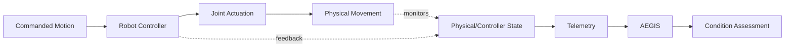

# Run and Activating The Simulation:
cd ~/Repos/600091-Honours-Stage-Project/6000091-Simulator
source .venv/bin/activate
python simulation/test_simulation.py

To open old niryostudio
cd ~/Downloads/NiryoStudio-4.0.1/NiryoStudio-linux-x64_v4.0.1
./NiryoStudio

